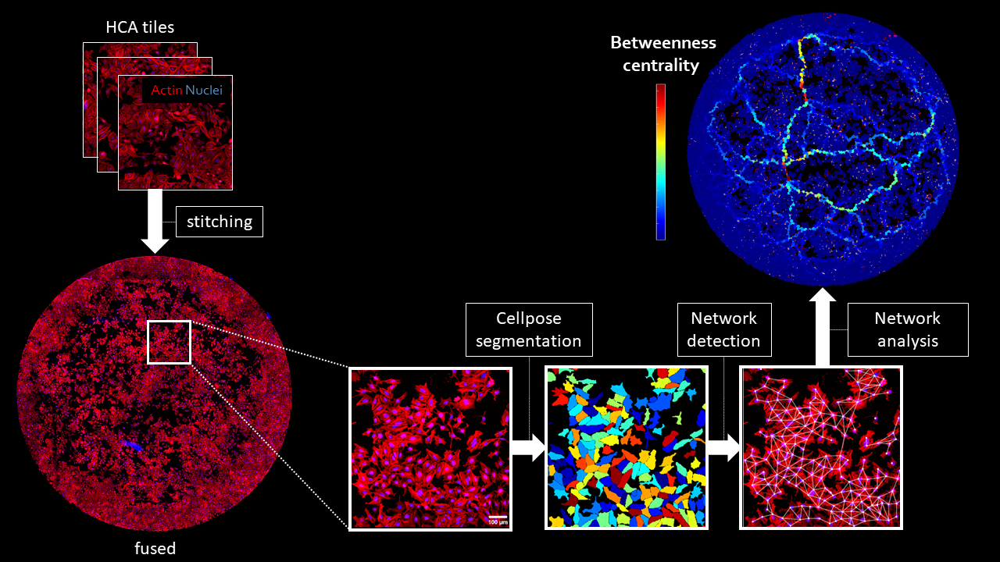

# Cell Contact Network
Processing and analysis of 2D cellular contact networks.  
This work was done at the Dimphna Meijer Lab, Faculty of Applied Sciences, Department of Bionanoscience, TU Delft. 

For the documentation of this repository, see https://lukasvandenheuvel.github.io/CellContactNetwork



## Cellpose installation on Windows

Follow these instructions to install [Cellpose](https://www.cellpose.org/) on your computer, together with other Packages you need for running the image processing in parallel. 

1. Install an [Anaconda](https://www.anaconda.com/products/individual) distribution. Choose Windows and python 3.7.
2. Clone or download this repository.
3. Open the Anaconda Prompt application.
4. Navigate to the folder where the ```environment.yml``` file is stored with ```cd path/to/folder```. To move to the M-drive, press ```M:``` and enter.
5. Run ```conda env create -f environment.yml```.
6. When all packages are installed, activate the environment with ```conda activate cellpose```.
7. You should see (```cellpose```) on the left side of the terminal line.
8. Run ```python -m cellpose``` to start up the Cellpose GUI. If it works, you're all set.

NOTE: if you are working on a Dimphna Meijer lab computer, and the above installation did not work for you (for whatever reason), there is the possibility to use a pre-installed environment on the TU Delft M-drive. *Keep in mind that using it is not recommended, because Python scripts will run significantly slower.* If you have no choice, you can activate this environment with ```conda activate M:\tnw\bn\dm\Shared\cellpose```.

## Running Cellpose

The script ```FindNetworkCellpose.py``` segments cells on a microscopy image (grayscale or RGB) using Cellpose, and finds the corresponding cellular contact network. The script takes as input a TIFF or PNG microscopy image (e.g. ```Input.tif```), and outputs 3 files:
- ```Input_cellpose_parameters_cyto.txt``` containing the parameters of the segmentation and network detection.
- ```Input_cellpose_segmentation_cyto.tif```, the segmented 32-bit image where each cell is labeled with a seperate grayscale value.
- ```Input_network_cyto.mat```, containing the extracted network and other cell measurements (e.g. positions of the centers of mass, the area, circularity, etc.).
If the input image is large, you can choose to do the segmentation in smaller patches.

To run the script, follow these instructions:

1. Open the Anaconda prompt.
2. Activate the cellpose environment with ```conda activate cellpose```.
3. Navigate to the Python folder of this repository with ```cd path/to/Python```. To move to the M-drive, press ```M:``` and enter.
4. Run ```python FindNetworkCellpose.py```.

