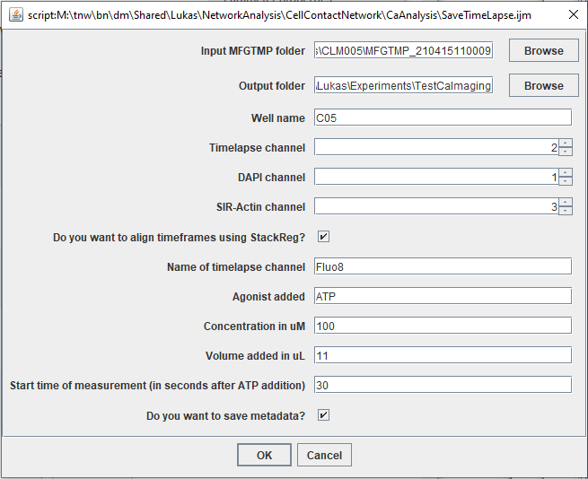

# Relate a cell's activity to its position in the network

<p align="center">
  
</p>

**Figure:** Ca2+ oscillations in 3T3 fibroblasts on the network-wide scale. [A] Maximum intensity projection of the Ca2+ indicator Fluo-8 across 181 frames. Cells which oscillated more than 2 times are marked with a red dot. [B] Image of a complete 3T3 culture, stained for nuclei (blue) and actin (red). [C] Fluo-8 intensity levels of oscillating cells at five time points. [D] Fluo-8 time trace of the 2 cells marked blue and green in [C]. [E] Time traces of all spiking cells in one field. Cells which are close together in the heatmap are also closer in the cell-contact network.  

## Inputs
- Raw data of a timelapse video of a Ca2+ indicator (Fluo-8) of one field.
- An RGB [stitched](stitching.md) (whole-well) image with a nuclear (Hoechst) and cytoplasmic (SIR-Actin) staining.
- A [segmentation](network_detection.md) of the whole-well image.

## Outputs

Time-traces of all cells in the field, together with the structural network of all cells on the well.

## Step-by-step usage

### 1. Create timelapse (Fiji)  
First, create a timelapse video of the Fluo-8 channel.

- In Fiji, run the macro [```SaveTimeLapse.ijm```](https://github.com/lukasvandenheuvel/CellContactNetwork/blob/main/CaAnalysis/SaveTimeLapse.ijm) and fill in the parameters:

<p align="center">
  
</p>  

- You can choose to align the timeframes of the timelapse (w.r.t. the first frame) with StackReg.
- The following files will be created in the output folder (filenames are examples following the parameters values as shown above):
1. ```C05_Fluo8_timelapse.tif```: timelapse video of the field.
2. ```C05_f##_RGB.tif```: RGB-image of Hoechst and SIR-Actin staining of the field (with field number ##).
3. ```C05_Ca_metadata.txt```: contains metadata of Ca-imaging.

### 2. Align the field in the fused image (Fiji)  
Next, find the coordinates of the field where the Ca2+ imaging was done in the fused (whole-well) image.

- In Fiji, run the macro [```AlignTileInFused.ijm.ijm```](https://github.com/https://github.com/lukasvandenheuvel/CellContactNetwork/blob/main/CaAnalysis/AlignTileInFused.ijm.ijm) and fill in the parameters:

<p align="center">
  
</p>  

- This macro runs the Preibisch et al. image stitching tool, to find the location inside the fused image where the tile has maximum overlap.
- In the folder where the fused image is stored, a file named ```C05_results_alignmentTileF01.txt``` will appear. This file contains the coordinates.

### 3. Create a segmentation of the field (Cellpose)  

- You can segment the field alone with [Cellpose](network_detection.md). Use ```C05_f##_RGB.tif``` as input image. Make sure to check the "do measurements" box.

### 4. Find the minimal peak prominence (Matlab)  
The Ca2+ oscillations - if there are any - are quantified with a Matlab built-in peak-finding algorithm, which takes a minimal peak prominence as input. First, you will find this minimal peak prominence.

- Run the script [```InteractiveTimeTracePlot.m```](https://github.com/lukasvandenheuvel/CellContactNetwork/blob/main/CaAnalysis/InteractiveTimeTracePlot.m).
- Carefully select the files asked.
- Enter the frame rate, and guess a peak prominence (e.g. start with 0.1).
- You will see the timelapse video, and subsequently the spiking cells are indicated with stars. The warmer the colour, the more often the cells spiked. Click on a cell to see whether the peaks were found correctly.
  
  
  
- If you are not satisfied with the found peaks, run the script again with a different peak prominence. (If too few peaks were detected, decrease the peak prominence).  

### 5. Extract time traces and relate them to network analysis (Matlab)  
Lastly, we use a Matlab script to combine the Ca2+ activity analysis to the social network analysis.

- Open the script [```CaFieldInFusedNetwork.m```](https://github.com/lukasvandenheuvel/CellContactNetwork/blob/main/CaAnalysis/CaFieldInFusedNetwork.m) and run it.  
  ⚠️ You will be asked to open several files, some referring to the fused image, others to the field. Pay attention and select the correct ones!
- Enter the frame rate.
- Enter the peak prominence you found in step 4.
- Enter the width / height of one the imaged field in um (in the HCA, this is ```873.96``` for the 10x objective and ```441.41``` for the 20x objective). 
- As an example, you will see a Ca2+ - intensity heatmap of the spiking cells, and a plot of the betweenness centrality versus the number of peaks in each cell:

  <p align="center">
    
  </p>  

- This script serves as a template. You can modify it s.t. it outputs your parameter of interest.
  
