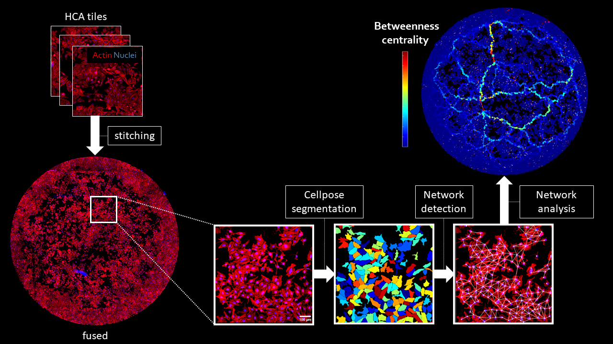

# Cell Contact Networks
Processing and analysis of 2D cellular contact networks.  
This work was done at the Dimphna Meijer Lab of Quantitative Neurobiology, Faculty of Applied Sciences, Department of Bionanoscience, TU Delft.  

<p align="center">
  
</p>

***

## [Installation](installation.md)  

## [Stitching](stitching.md)  

## [Cellpose Segmentation and Network Detection](network_detection.md)  

## [Network Analysis](network_analysis.md)  

## [Train a Cellpose Model](train_cellpose.md)  

<!---
### Markdown

Markdown is a lightweight and easy-to-use syntax for styling your writing. It includes conventions for

```markdown
Syntax highlighted code block

# Header 1
## Header 2
### Header 3

- Bulleted
- List

1. Numbered
2. List

**Bold** and _Italic_ and `Code` text

[Link](url) and 
```

For more details see [GitHub Flavored Markdown](https://guides.github.com/features/mastering-markdown/).

### Jekyll Themes

Your Pages site will use the layout and styles from the Jekyll theme you have selected in your [repository settings](https://github.com/BIOP/ijp-imagetoatlas/settings/pages). The name of this theme is saved in the Jekyll `_config.yml` configuration file.

### Support or Contact

Having trouble with Pages? Check out our [documentation](https://docs.github.com/categories/github-pages-basics/) or [contact support](https://support.github.com/contact) and we’ll help you sort it out.

-->
