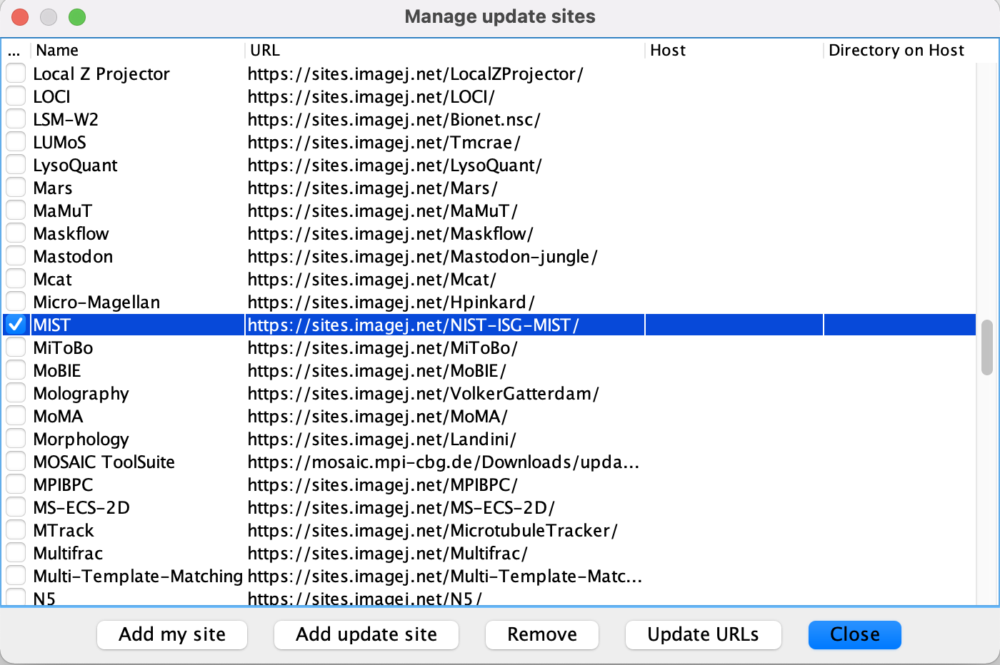

Back to [main page](index.md)

---

## Fiji macros installation

Follow these instructions to install [ImageJ](https://imagej.nih.gov/ij/) on your computer and activate the [MIST](https://pages.nist.gov/MIST/) update site. This will allow you to stitch a set of tiles generated by the High-Content Analyzer (CX7) into a fused image.  

- Install [Fiji](https://imagej.net/Fiji), if you had not installed it already.
- Make sure that ImageJ is updated to version ```v1.53h``` or higher. To check this, open Fiji and go to ```Help > Update ImageJ```. Press OK if the version number is lower than ```v1.53h```.
- To activate the MIST update site, go to ```Help > Update...``` and click ```Manage update sites```. Here, search for the MIST checkbox, check it, and press ```Close```.

<p align="center">
  
</p>

- Press ```Apply changes``` and restart Fiji.
- You can now start [stitching High-Content images](stitching.md).


## Cellpose installation on Windows

Follow these instructions to install [Cellpose](https://www.cellpose.org/) on your computer, together with other Packages you need for running the image processing in parallel. 

- Install an [Anaconda](https://www.anaconda.com/products/individual) distribution, if you had not installed it already. Choose Windows and python 3.7.
- Clone or download the [repository](https://github.com/lukasvandenheuvel/CellContactNetwork).
- Open the Anaconda Prompt application.
- Navigate to the folder where the ```environment.yml``` file is stored with ```cd path/to/folder```. To move to the M-drive, press ```M:``` and enter.


- Run ```conda env create -f environment.yml```.
- When all packages are installed, activate the cell-contact-network environment with ```conda activate ccn```.
- You should see (```ccn```) on the left side of the terminal line.
- Run ```python -m cellpose``` to start up the Cellpose GUI. If it works, you're all set and you can start [detecting multicellular networks](network_detection.md).  

---
Back to [main page](index.md)
