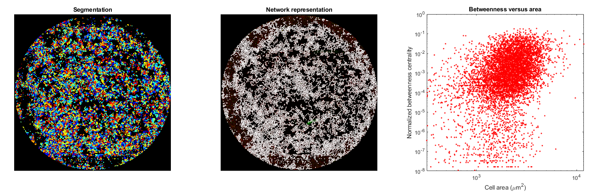

After you [detected a network](network_detection.md), you can read the measurement results in a Matlab datastructure array using the following Matlab command:  
```matlab
network = load('path/to/<input_name>_network_<model_name>.mat');
```  

Inside the ```network``` datastructure, you will find the following fields:
  - ```contact_matrix```: N x N sparse matrix, where N is the number of cells detected. This matrix is the contact matrix, which you can convert to a Matlab graph structure with the command 
```matlab
G = graph(network.contact_matrix);
```
  - ```img_size```: Size (width and height) of the input image in pixels.
  - ```label```: Array of cell values present on the segmented image.
  - ```area```: Area of cells in pixes^2.
  - ```centroid0```: y-coordinates of the cell centers of mass in pixels.
  - ```centroid1```: x-coordinates of the cell centers of mass in pixels.
  - ```orientation```: Orientation of the major axes of all cells. Is a number between ```-pi/2``` and ```pi/2```.
  - ```minor_axis_length```: Length of the cells minor axis in pixels.
  - ```major_axis_length```: Length of the cells major axis in pixels.
  - ```eccentricity```: Values between 0 and 1, for all cells. If the cell is a perfect circle, its eccentricity is 0. If a cell is a straight line, its eccentricity is 1.
  - ```perimeter```: Perimeter of cells in pixels.


---

⚠️ All spatial measurements (area, centroid, perimeter, etc.) are done in **pixels**. You will need to convert these values to milimeters or micrometers. 

---

The script [```GraphPlot.m```](https://github.com/lukasvandenheuvel/CellContactNetwork/blob/main/NetworkAnalysis/GraphPlot.m) provides an example of how to visualize the segmentation and the network representation. Also, it contains an example of a social network analysis (it plots the betweenness centrality - a global network parameter - versus the area of cells). Its output looks as follows:

<p align="center">
  
</p>
