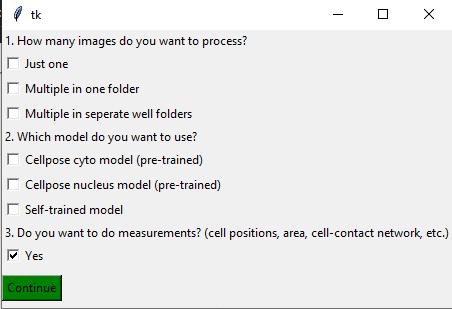
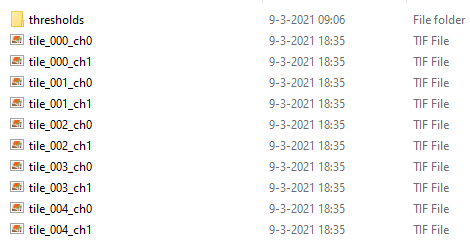
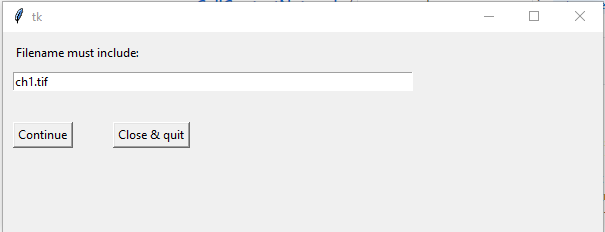
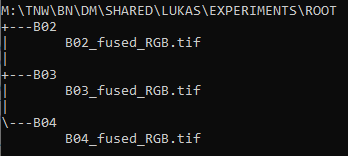
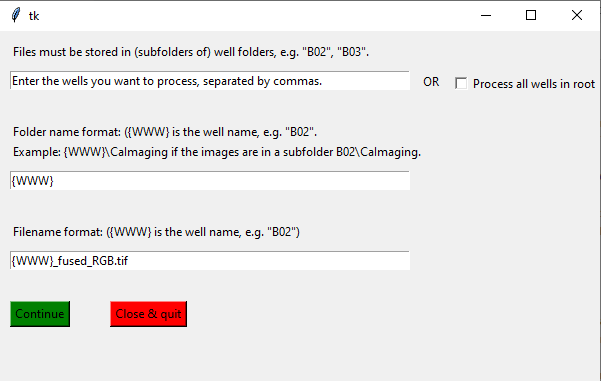
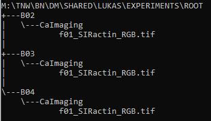
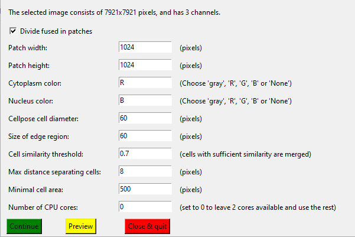

# Detect Multicellular Networks

The script ```FindNetworkCellpose.py``` segments cells on a microscopy image (grayscale or RGB) using Cellpose, and finds the corresponding cellular contact network. The script takes as input a TIFF or PNG microscopy image (e.g. ```Input.tif```), and outputs 3 files:
- ```Input_cellpose_parameters_cyto.txt``` containing the parameters of the segmentation and network detection.
- ```Input_cellpose_segmentation_cyto.tif```, the segmented 32-bit image where each cell is labeled with a seperate grayscale value.
- ```Input_network_cyto.mat```, containing the extracted network and other cell measurements (e.g. positions of the centers of mass, the area, circularity, etc.). You can also choose to omit this last file from the output.  

If the input image is large, you can choose to do the segmentation on smaller patches, and then align the patches back into a large segmentation.

To run the script, follow these instructions:

---  

1. Open the Anaconda prompt.

---  

2. Activate the cellpose environment with ```conda activate cellpose```.

---  

3. Navigate to the NetworkDetection folder of your local clone of this repository with ```cd path/to/NetworkDetection```. To move to the M-drive, type ```M:``` and press enter.

---  

4. Run ```python FindNetworkCellpose.py```. After a short while, you will be asked the following three questions:  

  

## 1. How many images do you want to process? 
Here, you are asked to indicate how many images you want to process, and how they are stored. 

### Only one
Select this option if you want to segment one file only (now matter how large it is). You will then be asked to select one TIFF or PNG image. The output files will be stored in the same folder as the input file.  

If you want to process a batch of files, you can choose to either store them in one folder, or store them in separate folders (one folder for each well).  

### Multiple in one folder
Select this option if, for example, you want to segment all *ch1* images in this folder:  



You will be asked to select the folder containing the images, and the output folder (where you want the segmented output files to be stored).  

If you want to process a subset of images in the folder (e.g. only the *channel 1* images), you can do so in the next dialog:  



If you want to process all images in the folder, it is recommended to enter the file extension here (```.PNG``` or ```.tif```) so that the program won't try to read any storage files.  

### Multiple in seperate well folders
You can use this last option if you, for example, want to segment fused images of wells that are stored in individual well folders:  

  

First you will be asked to select the ```root``` directory, i.e. the directory that contains the well folders. Then you enter further specifications:



You can either process a selection of wells (enter the well names seperated by commas, e.g. ```B02,B03```) or check the box ```Process all wells in root``` to process all folders inside the root directory you selected.  

Next, you can further specify the name of the folders where the images are stored, and the filenames themselves. Below are two examples of how to do this:  

*Example 1*  
  
Here, the ```<well>_fused_RGB.tif``` images are stored in folders which have the same name as the wells themselves. In that case, enter ```{WWW}``` as folder name format (the three W's stand for the well name, e.g. 'B02'), and ```{WWW}_fused_RGB.tif``` as filename format.  

*Example 2*  
   
Here, the images are all stored in a subfolder called ```CaImaging```. Now you enter ```{WWW}\CaImaging``` as folder name format, which represents the path to each RGB tiff image. The filename format is now ```f01_SIRactin_RGB.tif``` (note that all filenames are the same).  

## 2. Which model do you want to use?
[Cellpose](https://www.cellpose.org/) has two pre-trained models: one to detect the cell cytoplasm, and one to detect the nuclei. Alternatively, you can choose to use a custom-trained model. There is [a custom-trained model in the Github repository](https://github.com/lukasvandenheuvel/CellContactNetwork/tree/main/Cellpose/AISModel) to segment the soma and axon initial segment of neurons fluorescently stained with Ankyrin G.  

For instructions about how to train a Cellpose model yourself, see [train Cellpose](train_cellpose.md).  

If you select the self-trained model option, you will be asked to select the file with the model parameters. The name of the file should resemble this: ```cellpose_residual_on_style_on_concatenation_off_Cellpose_2021_05_04.236206```.  
*Note: do not change the name of this file!*.  

## 3. Do you want to do measurements?  
Leave this box checked if you want to measure cell properties (```cell-contact network```, ```area```, ```centroid coordinates```, ```orientation```, ```minor_axis_length```, ```major_axis_length```, ```eccentricity``` and ```perimeter```) and output the results in a Matlab file called ```<Input_name>_network_cyto.mat```.  

Once you click ```Continue```, the script will read **one of** the images you selected (if you chose to process multiple images, it will read the first in the list). You can now use this image to specify the parameters.  

---  

5. Choose the parameters for segmentation and network detection with the next dialog:

 
 
- ```Divide fused in patches```: This box will be automatically checked if the selected image has a width of more than 1200 pixels. When checked, the script will divide the whole image in overlapping patches of size ```patch width x patch height```, which will then be segmented sequentually. After the segmentation, the patches are aligned back into a fused segmentation.
- ```Patch width/height```: Is only used if ```Divide fused in patches``` is checked. A width/height of ```1024``` is the default, but you can also choose ```512```.
- ```Cytplasm color```: The color of the cytoplasm in your image. Enter ```R```, ```G``` or ```B``` if your image is RGB, ```gray``` if you have grayscale, and ```None``` if you have no cytoplasm channel.
- ```Nucleus color```: The color of the nuclei in your image. Enter ```R```, ```G``` or ```B``` if your image is RGB, ```gray``` if you have grayscale, and ```None``` if you have no nucleus channel.
- ```Cellpose cell diameter```: This parameter determines how large the segmented cells will roughly be. You are highly recommended to change it and press ```Preview``` to see how the diameter affects your segmentation.
- ```Size of edge region```: Is only used if ```Divide fused in patches``` is checked. If cells lie on a distance of less than ```Size of edge region``` from the edge of a patch, they are replaced with the corresponding cell on the overlapping patch. It is recommended to leave this parameter on 60 pixels.
- ```Cell similarity threshold```: Is only used if ```Divide fused in patches``` is checked. Cells on the edge of a patch are only replaced with the corresponding cell on the overlapping patch if the two cells are similar enough. It is recommended to leave this parameter on 0.7, but you can lower it if you see that cells on the edge between patches get lost.
- ```Max distance seperating cells```: Is used for network detection. Two cells which are seperated by a distance of less than ```Max distance seperating cells``` pixels are connected in the network. Change this parameter and press ```Preview``` to see how it alters the network detection, but a distance of 8 generally works well.
- ```Minimal cell area```: Segmentations with an area of less than ```Minimal cell area``` are removed. Change this parameter and press ```Preview``` to see how it alters segmentation.  
- ```Num CPU cores```: Is only used if ```Divide fused in patches``` is checked. Calculating the overlap between cells is done on multiple cores seperately. If you have many programs open, you are recommended to use ~3/4 of the cores in your machine. Leave this parameter at 0 to leave 2 cores available and use the rest for segmentation.

If you are satisfied with the parameter settings (press ```Preview``` to check), **close the Preview window on the right** (you might need to press the close button several times, this is normal). Then, press the green ```Continue``` button. Depending on the size of the image, the segmentation may take several seconds (for an image with 1024 x 1024 pixels) or up to one hour (for a fused image taken with 20x magnification). You can see the progress in the Anaconda prompt. 

---

6. When the segmentation is done, you can read the measurement results in a Matlab datastructure array using the Matlab command  
```matlab
load('path/to/<Input_name>_network_cyto.mat')
```

---
