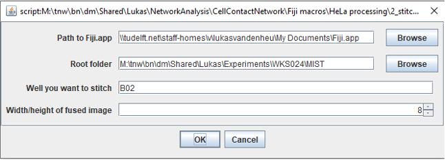
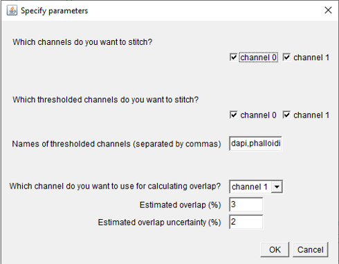

# Stitch High-Content Images

You need the Fiji macros [```1_PrepareTilesMIST.ijm```](https://github.com/lukasvandenheuvel/CellContactNetwork/blob/main/Stitching/1_PrepareTilesMIST.ijm) and [```2_StichMIST```](https://github.com/lukasvandenheuvel/CellContactNetwork/blob/main/Stitching/2_StitchMIST.ijm) to stitch a set of overlapping tiles generated by the High-Content Analyzer into a fused microscopy image. The stitching is done in 2 steps.

## 1. Prepare tiles with the macro ```1_PrepareTilesMIST.ijm```.

### Input  
A directory with images created by the HCA (raw folder). **Images of seperate wells should be stored in seperate well folders**. Example of image filename: ```MFGTMP_201022140001_B03f00d0.tif```.  
The number after “f” denotes the position of the tile in a spiral grid. The number after “d” denotes the channel number.  

### Output  
Well folders (one for each well) inside the root folder. These well folders contain tiles and thresholded tiles. The template for tile names is:
```tile_{ppp}_ch{t}.tif```  
where ```ppp``` is the position of the tile in a column grid and ```t``` is the channel number.  
Also, a file ```<well>_parameters_prepareTiles.txt```, which contains the parameters you selected, is stored in the well folder.

### Usage
Open Fiji, drag the file ```1_PrepareTilesMIST.ijm``` into the Fiji menu bar, and press 'Run'. In the first dialog, you enter where the input images are stored (Raw folder), where you want the prepared tiles to be stored (Root folder), which wells you want to process, how many channels you have, and what the size of the fused image is. You will get error messages if the wells are not found in the raw folder. Also, you will get error messages if the number of channels or the width/height of the fused image does not match the number of images found in the input well folders. **Note that the Raw and Root folders are one directory upstream of the well folders ('B02', 'B03', etc.). Do not select a folder with the name of a well.**  


In the second dialog you can enter additional parameters. Importantly, the HCA seems to be inconsistent in the direction of the spiral (either clockwise or anticlockwise). Use the macro [```0_clockOrAnticlock.ijm```](https://github.com/lukasvandenheuvel/CellContactNetwork/blob/main/Stitching/0_ClockOrAnticlock.ijm) to find out whether the spiral direction is clockwise or anticlockwise. **The operations (downscaling, contrast enhancement, background subtraction and blurring+thresholding) are done in the order in which they appear on this dialog.** Test these operations on individual tiles before you run this macro.  

  

Overview of spiral grid (clockwise) and column grid for 10x and 20x magnification:

  
  

## 2. Stitch tiles with the macro ```2_StitchMIST.ijm```.

### Input   
Prepared tiles created with the macro ```1_prepareTilesMIST.ijm```.  

### Outputs  
-	Multi-channel image ```<well>_fused.tif``` stored inside the well folder.
-	8-bit RBG image ```<well>_fused_RGB.tif```.
-	Fused grayscale images, one for each thresholded channel (if you chose to stitch thresholded channels).
-	Text files containing the coordinates of tiles in the fused image.
-	A file ```<well>_parameters_stitching.txt``` containing the parameters you selected.

### Usage
Open Fiji, drag the file ```2_StitchMIST.ijm``` into the Fiji menu bar, and press 'Run'. In the first screen you enter the path to Fiji.app on your local machine (usually in the applications folder), the root folder. Note that you can only stitch one well at the time.

  

When you click OK, the macro will detect which channels and thresholded channels there are in the well folder you specified. You can choose which of these channels you want to stitch, and give names to the thresholded channels.  

Note that you can only use one channel for calculating overlap (channel 1 in the example below). The remaining channels and the thresholded channels will be stitched based on the coordinates of this overlap channel. There is also the option to brute-force stitch (no overlap will be calculated).

  

Once you click OK, the stitching will start. You can see the progress in the LOG window.

## Additional information on MIST  

MIST is a stitching tool based on Fourier-based translation. For information and publications, see [here](https://pages.nist.gov/MIST/).  

I highly recommend trying out the plugin yourself, before using the macros described above (You can find it in Fiji: ```Plugins > Stitching > MIST```).
The important parameters to change are under the tabs “Input” and “Advanced”. Below, I highlighted three of them.  

```Timeslices:``` the channel(s) you wish to stitch. Note that MIST can only calculate 2D overlaps, so when you run MIST for the first time on this image, you can only enter one number here. Once you have calculated the overlaps in one channel (say, channel 1), you can stitch the remaining channels based on the image coordinates  of channel 1.  

Example: you have 4 channels (ch 0-3), and you wish to calculate the overlaps based on channel 1. The other channels will then be stitched based on the coordinates of channel 1. You now need to run the MIST plugin twice:  

First run: 
-	Timeslices = 1
-	Leave the “Assemble from metadata” check button unchecked.  

Copy the outputted file ```img-global-positions-1.txt``` once for each channel, to get 
```img-global-positions-0.txt```, ```img-global-positions-2.txt```, and ```img-global-positions-3.txt```.

Second run: 
-	Timeslices = 0,2,3
-	Check “Assemble from metadata”.
-	Global Positions File: ```path/to/positions/files/img-global-positions-{t}.txt```
The macro ```2_stitchMIST.ijm``` will do these steps automatically for you.  

```Horizontal / Vertical overlap``` (under “Advanced”): Estimation of the overlap % between the tiles. I recommend 3%, but varying this number will significantly change the stitching result..  

```Overlap uncertainty``` (under “Advanced”): This number should be strictly smaller than the Horizontal/Vertical overlap, otherwise you’ll get “gaps” in the stitched image.

  


