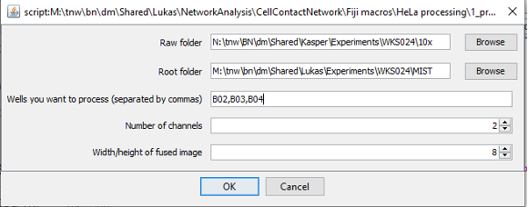
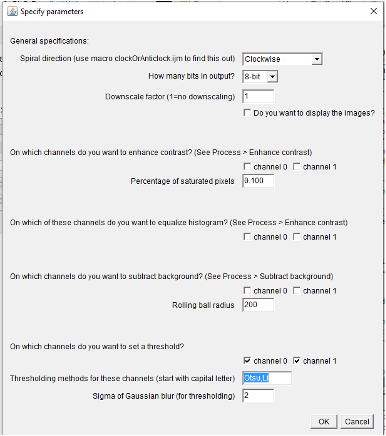
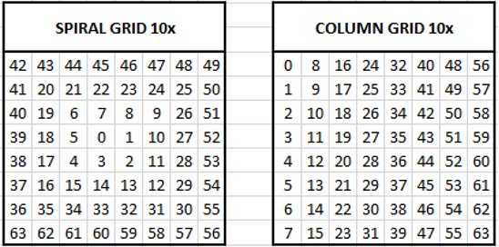

# Stitch High-Content Images

You need the Fiji macros [```1_PrepareTilesMIST.ijm```](https://github.com/lukasvandenheuvel/CellContactNetwork/blob/main/Stitching/1_PrepareTilesMIST.ijm) and [```2_StichMIST```](https://github.com/lukasvandenheuvel/CellContactNetwork/blob/main/Stitching/2_StitchMIST.ijm) to stitch a set of overlapping tiles generated by the High-Content Analyzer into a fused microscopy image.

## Prepare tiles using the macro ```1_PrepareTilesMIST.ijm```.

### Input  
A directory with images created by the HCA (raw folder). **Images of seperate wells should be stored in seperate well folders**. Example of image filename: ```MFGTMP_201022140001_B03f00d0.tif```.  
The number after “f” denotes the position of the tile in a spiral grid. The number after “d” denotes the channel number.  

### Output  
Well folders (one for each well) inside the root folder. These well folders contain tiles and thresholded tiles. The template for tile names is:
```tile_{ppp}_ch{t}.tif```  
where ```ppp``` is the position of the tile in a column grid and ```t``` is the channel number.  
Also, a file ```<well>_parameters_prepareTiles.txt```, which contains the parameters selected by the user, is stored in the well folder.

### Usage
Open Fiji, drag the file ```1_PrepareTilesMIST.ijm``` into the Fiji menu bar, and press 'Run'. In the first dialog, you enter where the input images are stored (Raw folder), where you want the prepared tiles to be stored (Root folder), which wells you want to process, how many channels you have, and what the size of the fused image is. You will get error messages if the wells are not found in the raw folder. Also, you will get error messages if the number of channels or the width/height of the fused image does not match the number of images found in the input well folders. **Note that the Raw and Root folders are one directory upstream of the well folders ('B02', 'B03', etc.). Do not select a folder with the name of a well.**  



In the second dialog you can enter additional parameters. Importantly, the HCA seems to be inconsistent about the direction of the spiral (either clockwise or anticlockwise). Use the macro [```0_clockOrAnticlock.ijm```](https://github.com/lukasvandenheuvel/CellContactNetwork/blob/main/Stitching/0_ClockOrAnticlock.ijm) to find out whether the spiral direction is clockwise or anticlockwise. **The operations (downscaling, contrast enhancement, background subtraction and blurring+thresholding) are done in the order in which they appear on this dialog.** Test these operations on individual tiles before you run this macro.  

  

Overview of spiral grid (clockwise) and column grid for 10x and 20x magnification:

  
  


