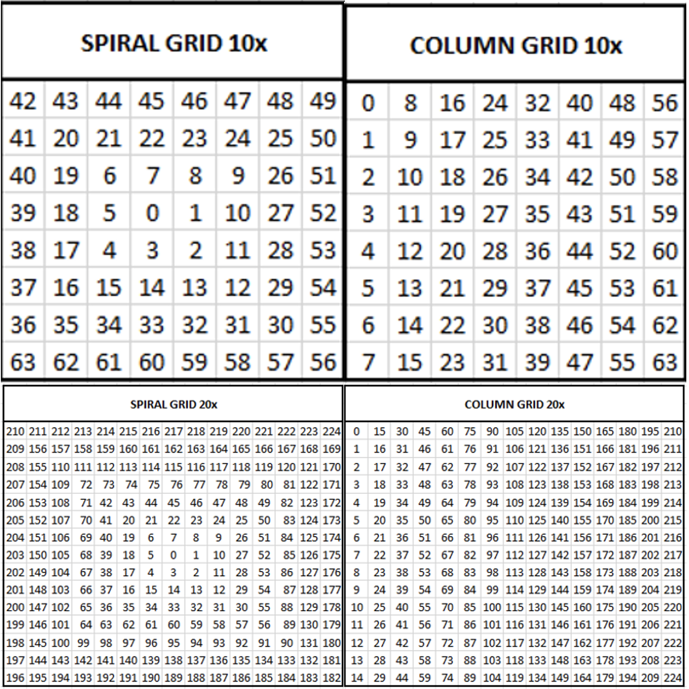
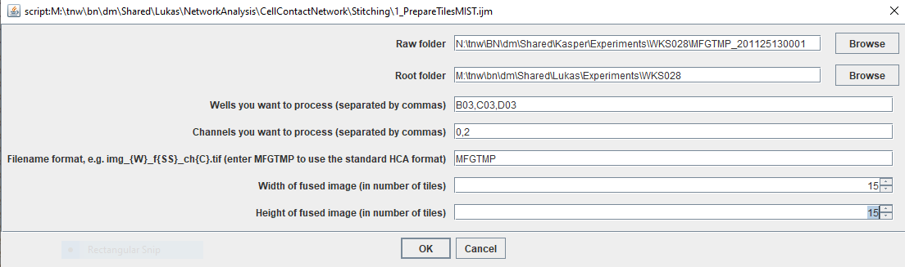
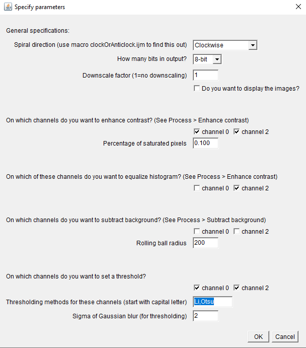
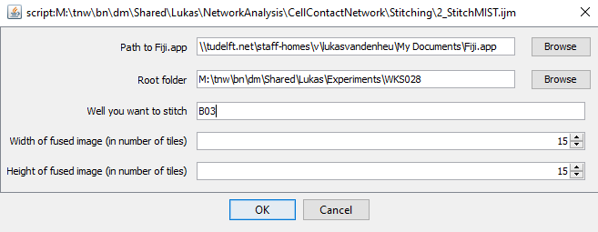
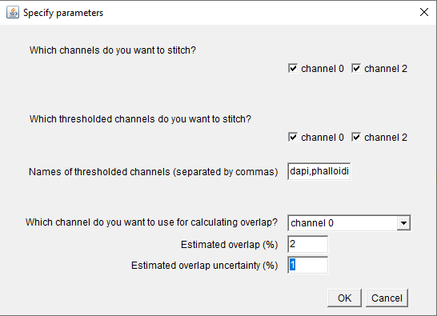
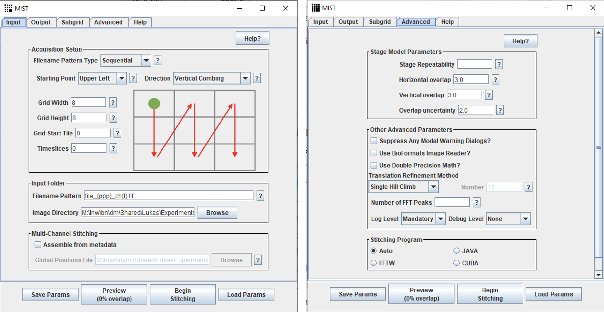
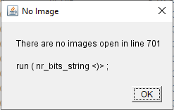

# Stitch High-Content Images

Stitching tiles into a fused image is done with [MIST](https://pages.nist.gov/MIST/), which was developed by the U.S. National Institute of Standards and Technology.

To make the process automated, you can use the Fiji macros ```1_PrepareTilesMIST.ijm``` and ```2_StichMIST``` to stitch a set of overlapping tiles generated by the High-Content Analyzer into a fused microscopy image. As outlined below, the stitching is done in 2 steps.

---

:warning: The Fiji macro language cannot handle **spaces in folder names**. When using these macro's, make sure that your directory paths do not contain spaces. For instance, use ```DM_lab``` as a folder name instead of ```DM lab```.

---

---

:warning: If you encounter unexpected errors, see the **Frequently occurring errors** section all the way down this page.

---

## 1. Prepare tiles with the macro ```1_PrepareTilesMIST.ijm```.

### Input  
A directory with images created by the HCA (raw folder). **Images of seperate wells should be stored in seperate well folders**. Example of image filename: ```MFGTMP_201022140001_B03f00d0.tif```.   
The number after “f” denotes the position of the tile in a spiral grid. The number after “d” denotes the channel number. You can also enter a filename template, if you have images with a different name format.  

### Output  
Well folders (one for each well) inside a root folder. These well folders contain tiles and thresholded tiles. The template for tile names is:
```tile_{ppp}_ch{t}.tif```  
where ```ppp``` is the position of the tile in a column grid and ```t``` is the channel number.  
Also, a file ```<well>_parameters_prepareTiles.txt```, which contains the parameters you selected, is stored in the well folder.  

Overview of spiral grid (clockwise) and column grid for 10x and 20x magnification:

<p align="center">
  
</p>

### Usage
- Open Fiji, drag the file [```1_PrepareTilesMIST.ijm```](https://github.com/lukasvandenheuvel/CellContactNetwork/blob/main/Stitching/1_PrepareTilesMIST.ijm) into the Fiji menu bar, and press 'Run'. 
- In the first dialog, you enter:
  - The path to the MFGTMP folder storing the input tiles (```Raw folder```).  
:warning: *Inside* the ```Raw folder```, there should be well folders containing the input images. **Do not select a folder with the name of a well.** 
  - Where you want the well folders with the prepared tiles to be stored (```Root folder```).
  - Which wells you want to process, e.g ```B02,B03,B04```.
  - Which channels you want to process have, e.g. ```0,1,3```.
  - The ```filename format```. If you have images generated by the HCA with names like ```MFGTMP_201022140001_B03f00d0.tif```, enter ```MFGTMP``` (the format will be generated automatically).  
If you have images with a different name format, e.g. ```img_B02_f00_ch0.tif```, enter the filename format ```img_{W}_f{SS}_ch{C}.tif```. Here, ```{W}``` is the well name (```B02```), ```{SS}``` denotes the position of the tile in the spiral grid (```00```), and ```{C}``` denotes the channel (```0```). The length of the ```SS``` and ```C``` characters are the *minimal* length of the numbers in the format. For example, if the filename is ```img_B02_f000_ch00.tif```, use ```{SSS}``` and ```{CC}``` instead of ```{SS}``` and ```{C}```.
  - The width of the fused image (i.e. the number of tiles that fit horizontally in the grid).
  - The height of the fused image (i.e. the number of tiles that fit vertically in the grid).  

You will get error messages if the wells are not found in the raw folder. Also, you will get error messages if the number the width/height of the fused image does not match the number of images found in the input well folders.

<p align="center">
  
</p>

- Click OK. In the second dialog you can enter additional parameters: 
  - ```Spiral direction```: the HCA seems to be inconsistent in the direction of the spiral (either clockwise or anticlockwise). Use the macro [```0_clockOrAnticlock.ijm```](https://github.com/lukasvandenheuvel/CellContactNetwork/blob/main/Stitching/0_ClockOrAnticlock.ijm) to find out whether the spiral direction is clockwise or anticlockwise. 
  - You can change the bith depth and size of the tiles.
  - You can choose to do the following pre-processing operations on individual tiles: enhance contrast (see ```Process > Enhance contrast```), equalize histogram (also in ```Process > Enhance contrast```), subtract background (```Process > Subtract background```). If you want to use them, test these operations on individual input tiles before you run this macro. 
  - You can choose to set a threshold on the tiles. The thresholds will be stored in a seperate ```thresholds``` folder. A smoothing Gaussian blur is applied before the thresholding.
  - **The operations (downscaling, contrast enhancement, background subtraction and blurring+thresholding) are done in the order in which they appear on this dialog.** Test these operations on individual tiles before you run this macro.  

<p align="center">
  
</p>

- Click OK to start the tile preparation. You can see the progress in the Log window.

## 2. Stitch tiles with the macro ```2_StitchMIST.ijm```.

### Input   
Prepared tiles created with the macro ```1_prepareTilesMIST.ijm```.  

### Outputs  
-	Multi-channel image ```<well>_fused.tif``` stored inside the well folder.
-	8-bit RBG image ```<well>_fused_RGB.tif```.
-	Fused grayscale images, one for each thresholded channel (if you chose to stitch thresholded channels).
-	Text files containing the coordinates of tiles in the fused image.
-	A file ```<well>_parameters_stitching.txt``` containing the parameters you selected.

### Usage
- Open Fiji, drag the file [```2_StitchMIST.ijm```](https://github.com/lukasvandenheuvel/CellContactNetwork/blob/main/Stitching/2_StitchMIST.ijm) into the Fiji menu bar, and press 'Run'. 
- In the first screen you enter: 
  - The path to Fiji.app on your local machine (usually in the applications folder) 
  - The root folder (where the well folders are). **Do not select a folder with the name of a well**. 
  - The well you want to stitch. Note that you can only stitch one well at the time.
  - The width and height of the fused image grid (in number of tiles).

<p align="center">
  
</p>

- When you click OK, the macro will detect which channels and thresholded channels there are in the well folder you specified. You can choose which of these channels you want to stitch, and give names to the thresholded channels.  
- Note that you can only use one channel for calculating overlap (channel 1 in the example below). The remaining channels and the thresholded channels will be stitched based on the coordinates of this overlap channel. There is also the option to brute-force stitch (no overlap will be calculated).

<p align="center">
  
</p>

- Once you click OK, the stitching will start. You can see the progress in the LOG window.

## Additional information on MIST  

MIST is a stitching tool based on Fourier-based translation. For information and publications, see [here](https://pages.nist.gov/MIST/).  

I highly recommend trying out the plugin yourself, before using the macros described above (You can find it in Fiji: ```Plugins > Stitching > MIST```).
The important parameters to change are under the tabs “Input” and “Advanced”. Below, I highlighted three of them.  

- ```Timeslices:``` the channel(s) you wish to stitch. Note that MIST can only calculate 2D overlaps, so when you run MIST for the first time on this image, you can only enter one number here. Once you have calculated the overlaps in one channel (say, channel 1), you can stitch the remaining channels based on the image coordinates  of channel 1.  
Example: you have 4 channels (ch 0-3), and you wish to calculate the overlaps based on channel 1. The other channels will then be stitched based on the coordinates of channel 1. You now need to run the MIST plugin twice:  
First run: 
  -	Timeslices = 1
  -	Leave the “Assemble from metadata” check button unchecked.  
Copy the outputted file ```img-global-positions-1.txt``` once for each channel, to get 
```img-global-positions-0.txt```, ```img-global-positions-2.txt```, and ```img-global-positions-3.txt```.  

  Second run:  
  -	Timeslices = 0,2,3
  -	Check “Assemble from metadata”.
  -	Global Positions File: ```path/to/positions/files/img-global-positions-{t}.txt```
The macro ```2_stitchMIST.ijm``` will do these steps automatically for you.  

- ```Horizontal / Vertical overlap``` (under “Advanced”): Estimation of the overlap % between the tiles. I recommend 3%, but varying this number will significantly change the stitching result..  

- ```Overlap uncertainty``` (under “Advanced”): This number should be strictly smaller than the Horizontal/Vertical overlap, otherwise you’ll get “gaps” in the stitched image.

<p align="center">
  
</p>

## Frequently occurring errors

```There are no images open in line xxx```  

<p align="center">
  
</p>  

This error implies that Fiji succeeded in finding an image with the correct filename, but it cannot open it.  
Fix: Check the **file sizes** of your input images. Presumably, there is/are image(s) with file sizes that deviate from the other images in the well folder. That means something went wrong with the export of images from the HCA! Export the images again, or (if the image is not important because it was at the edge of the well anyway) you can overwrite the wrongly exported image with a black image with the correct dimensions and the same filename.  

