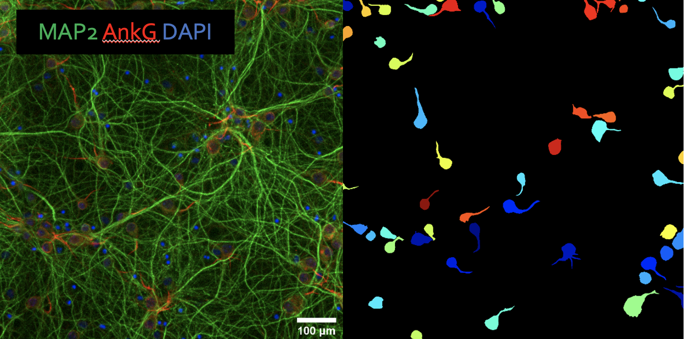
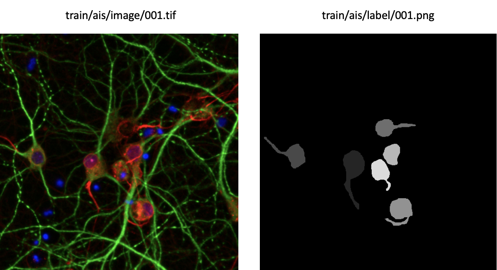
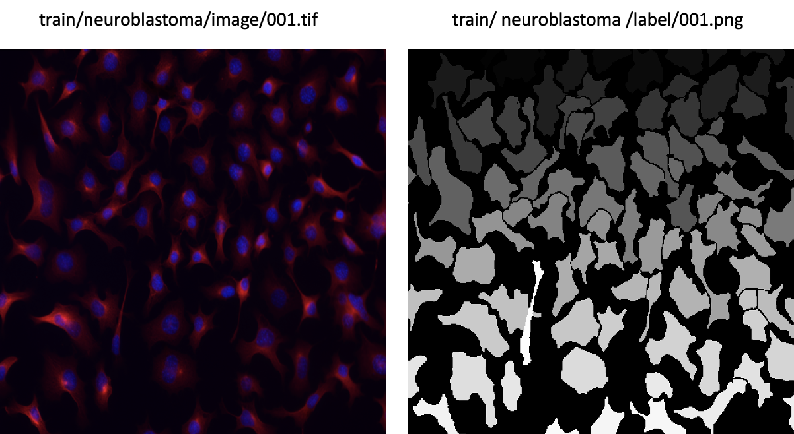
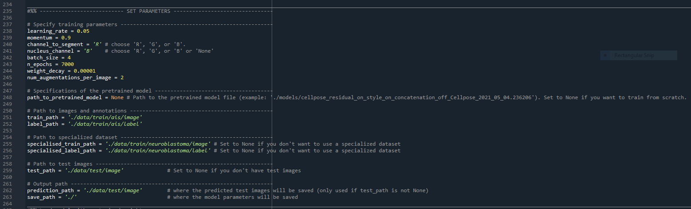

# Train Cellpose

If the Cellpose ```cyto``` or ```nuclei``` models perform poorly on your type of microscopy images, you might consider training Cellpose yourself with hand-annotated data.  

Below, an example is described for training a Cellpose model to segment the soma and axon initial segment (ais) of neuronal cells.

<p align="center">
  
</p>

Summary of training data:

|              Dataset             	| Num images 	| Augmented? 	| Final num images 	|
|:--------------------------------:	|:----------:	|:----------:	|:----------------:	|
|     AIS data (hand-annotated)    	|     77     	|     yes    	|        231       	|
| Specialized data (neuroblastoma) 	|     100    	|     no     	|        100       	|
|               Total              	|      -     	|      -     	|        331       	|

## Data preparation and annotation

Note that Cellpose takes 2 channels as input: one channel to segment, and one nucleus channel. Here, we used RGB images with the AIS staining as red channel and the nucleus staining as the blue channel. The green channel contained the MAP2 staining, but Cellpose does not use it. 
- We made a training set of 77 images (512 x 512 pixels).
- We saved the images as RGB (in Fiji: ```Image > Type > RGB color```) with the names ```001.tif```, ```002.tif```, etc. inside the folder ```Cellpose/data/train/ais/image```.
- We annotated these training images using the Cellpose GUI. To start up the Cellpose GUI, open the Anaconda prompt and activate the ccn environment with ```conda activate ccn```. Then run ```python -m cellpose```. For instructions on how to make annotations with Cellpose, see https://cellpose.readthedocs.io/en/latest/gui.html#contributing-trainin§g-data.
- We stored the annotated labels as ```001.png```, ```002.png```, etc. in ```Cellpose/data/train/ais/label```.

<p align="center">
  
</p>

## Specialized dataset

Next to our own hand-annotated dataset, we used a pre-annotated dataset of 100 [neuroblastoma microscopy images from the Cell Image Library](http://www.cellimagelibrary.org/images/CCDB_6843). In the Cellpose paper, this dataset is referred to as the *specialized dataset*.  

We downloaded this dataset, gave every cell a unique label, and stored the microscopy images in ```Cellpose/data/train/neuroblastoma/image``` and the corresponding labels in ```Cellpose/data/train/neuroblastoma/label```.

<p align="center">
  
</p>

## Training

- The script [```TrainCellpose.py```](https://github.com/lukasvandenheuvel/CellContactNetwork/blob/main/Cellpose/TrainCellpose.py) can be used to train a Cellpose model. In the ```START PARAMETERS``` section, you can change the training parameters:

<p align="center">
  
</p>

- We trained the model according to the parameters above. Note that you can set ```specialized_train_path``` to ```None``` if you don't want to use a specialized dataset.
- Note that data-augmentation of 2 images per input image was done on the AIS dataset only (not on the specialized dataset). In total this yielded a training set of size ```3*77 + 100 = 331```.
- When the training is done, a file with the model weights will be saved in the folder ```Cellpose/models```. The filename will resemble something like this:  
```cellpose_residual_on_style_on_concatentation_off_Cellpose_2021_04.236206```.

---

⚠️ Do not change the name of this file! If you do, you won't be able to use the model weights later on.

---

- A second file ```Cellpose/models/cellpose_residual_on_style_on_concatentation_off_Cellpose_2021_04_training_details.csv``` will be stored. This file contains a summary of the training parameters.
- Use the script [```EvaluateCellpose.py```](https://github.com/lukasvandenheuvel/CellContactNetwork/blob/main/Cellpose/EvaluateCellpose.py) if you want to compare the performance of multiple trained models. To run this script, you will need a set of test images (which are different from the training images) stored in ```Cellpose/data/test/image``` with corresponding labels in ```Cellpose/data/test/label```. The filenames should be like those in the training set, i.e. ```001.tif```, ```002.tif```, etc. for images and ```001.png```, ```002.png``` for corresponding labels.
- Once you are happy with the model, store it in a seperate folder and [use it as self-trained model](https://lukasvandenheuvel.github.io/CellContactNetwork/network_detection.html).
