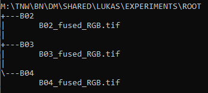
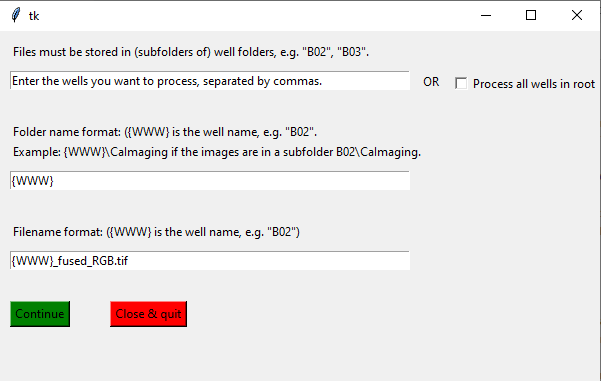
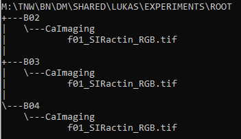

## Running the Cellpose-based network finder

The script ```FindNetworkCellpose.py``` segments cells on a microscopy image (grayscale or RGB) using Cellpose, and finds the corresponding cellular contact network. The script takes as input a TIFF or PNG microscopy image (e.g. ```Input.tif```), and outputs 3 files:
- ```Input_cellpose_parameters_cyto.txt``` containing the parameters of the segmentation and network detection.
- ```Input_cellpose_segmentation_cyto.tif```, the segmented 32-bit image where each cell is labeled with a seperate grayscale value.
- ```Input_network_cyto.mat```, containing the extracted network and other cell measurements (e.g. positions of the centers of mass, the area, circularity, etc.). You can also choose to omit this last file from the output.  
If the input image is large, you can choose to do the segmentation in smaller patches.

To run the script, follow these instructions:

1. Open the Anaconda prompt.
2. Activate the cellpose environment with ```conda activate cellpose```.
3. Navigate to the NetworkDetection folder of your local clone of this repository with ```cd path/to/NetworkDetection```. To move to the M-drive, press ```M:``` and enter.
4. Run ```python FindNetworkCellpose.py```. After a short while, you will see the following dialog appear:  

  

**How many images do you want to process?**  
For the first question, you are asked to indicate how many files images you want to process, and how they are stored.  
Segmenting one image (option 1) is straightforward: you will be asked to select the TIFF or PNG image. The output files will be stored in the same folder as the input file.  

If you want to process a batch of images, you can choose to either store them in one folder, or store them in separate folders (one folder for each well).  

*Images stored in one folder*  
Select this option if, for example, you want to segment all *channel 1* images in this folder:  


You will be asked to select the folder containing the images, and the output folder (where you want the segmented output files to be stored).  
If you want to process a subset of images in the folder (e.g. only the *channel 1* images), you can do so in the next dialog:


If you want to process all images in the folder, it is recommended to enter the file extension here (```.PNG``` or ```.tif```) so that the program won't try to read any storage files.  

*Images stored in well folders*  
You can use this last option if you, for example, want to store fused images of wells that are stored in individual well folders:  

  

First you will be asked to select the ```root``` directory, i.e. the directory that contains the well folders.  
In the following dialog you can enter further specifications:  



You can either process a selection of wells (enter the well names seperated by commas, e.g. ```B02,B03```) or check the box ```Process all wells in root```.  

Next, you can further specify the name of the folders where the images are stored. In the example above, the ```fused_RGB.tif``` images are stored in folders which have the same name as the wells themselves. In that case, enter ```{WWW}``` (the three W's stand for the well name, e.g. 'B02'). If the images are all stored in a subfolder called ```CaImaging```, like in the example below,  

  

you enter ```{WWW}\CaImaging```, which represents the path to each RGB tiff image.  

In the last entry you enter the name of the files. This would be ```{WWW}_fused_RGB.tif``` in the first example given above, and ```f01_SIRactin_RGB.tif``` in the second example.  

**Which model do you want to use?**  
[Cellpose](https://www.cellpose.org/) has two pre-trained models: one to detect the cell nuclei, and one to detect the cytplasm. Alternatively, you can choose to use a custom-trained model. For instructions about how to train a Cellpose model yourself, see [train Cellpose](train_cellpose.md).  
If you select the self-trained model option, you will be asked to select the file with the model parameters. The name of the file should resemble this: ```cellpose_residual_on_style_on_concatenation_off_Cellpose_2021_05_04.236206```. *Note: do not change the name of this file!*.

**Do you want to do measurements?**  
Leave checked if you want to measure cell properties (```cell-contact network```, ```area```, ```centroid coordinates```, ```orientation```, ```minor_axis_length```, ```major_axis_length```, ```eccentricity``` and ```perimeter```) and output the results in a Matlab file called ```<Input_name>_network_cyto.mat```. To read the results in a Matlab datastructure array, use the Matlab command  
```matlab
load('path/to/<Input_name>_network_cyto.mat')
```

5. Choose the parameters for segmentation and network detection.
